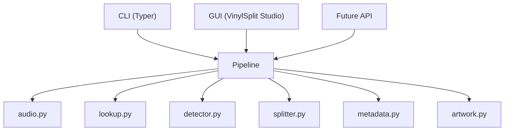
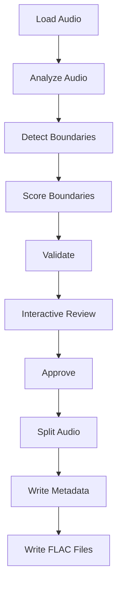

# VinylSplit Architecture

## Philosophy

VinylSplit separates user interfaces from the processing engine.

This allows multiple front ends (CLI, GUI, or future integrations) to share the same core functionality.

## System Architecture



## Processing Pipeline

VinylSplit processing is staged so each phase can be tested independently.



### Interactive Review Stage

- Runs after boundary detection and validation.
- Is the only stage that reads user track editing commands.
- Must be approved before splitting starts.
- Supports safe cancellation with no output files written.

The review workflow is implemented in the review layer and does not duplicate
business logic from detection or splitting components.

## Adaptive Review Architecture (Milestone 3)

### Boundary Lifecycle

Every boundary has a `BoundaryState`:

| State | Meaning |
|-------|---------|
| `AUTO` | Created by the detector. May be replaced by future detection passes. |
| `LOCKED` | Manually positioned by the user. Never moved automatically. |
| `VERIFIED` | Explicitly accepted by the user. Treated as final. |
| `SUGGESTED` | Candidate from local reanalysis. Informational only. |

State transitions:

```
AUTO → LOCKED    (user edits the boundary)
AUTO → VERIFIED  (user runs "verify <track>")
LOCKED → VERIFIED (user runs "verify <track>" on a locked boundary)
```

Undo restores the previous complete state, including BoundaryState.

### Review Session Lifecycle

```
Pipeline.create_review_session()  →  AdaptiveReviewState
    ↓
ReviewSession.run()  ← user input loop
    ↓
    each edit:
        1. apply_edit(mutate_fn)     — snapshot → mutate → normalize
        2. _after_edit()             — LocalAnalyzer.analyze_neighborhood()
        3. set_suggestions()         — store Suggestion objects
        4. _render()                 — display updated table + suggestions
    ↓
user types "split"
    ↓
AdaptiveReviewState.accept_all()  →  boundaries returned to Pipeline
    ↓
Pipeline continues with splitting and tagging
```

### Adaptive Analysis Architecture

```
LocalAnalyzer
  │
  ├── RMSAnalyzer       — computes energy profile over narrow window
  ├── SilenceDetector   — finds silence regions in window
  └── SuggestionEngine  — compares candidates to current boundary position
                          emits at most one Suggestion per boundary
```

The window is limited to the two or three tracks adjacent to the edited
boundary.  Full album re-detection is never triggered by a user edit.

### Module Responsibilities

| Module | Responsibility |
|--------|----------------|
| `boundary_states.py` | `BoundaryState` enum and display helpers |
| `review_state.py` | `AdaptiveReviewState` — mutations, undo/redo, suggestions |
| `suggestions.py` | `Suggestion` model — informational, never auto-applied |
| `adaptive_analysis.py` | `LocalAnalyzer`, `SuggestionEngine` — audio analysis |
| `review_session.py` | `ReviewSession` — interaction only, no business logic |
| `boundary_validation.py` | Validation rules and warning generation |

## Design Principles

- One responsibility per module.
- Business logic never depends on the user interface.
- The original recording is never modified.
- Every feature should be testable.
- The CLI and GUI must use the same processing pipeline.
- Manual user edits are always authoritative and are never silently overridden.