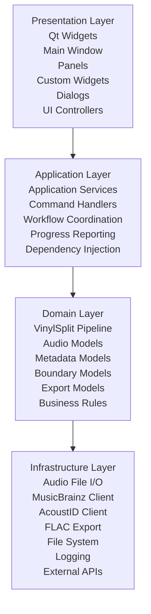
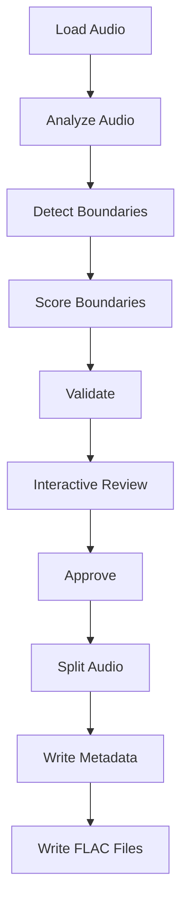

# VinylSplit Architecture

## Architectural Objective

VinylSplit follows a layered architecture with strict responsibility boundaries
so the product can support CLI, GUI, API, batch, and plugin interfaces over
many releases without structural redesign.

The core design intent is:

- user interfaces remain replaceable
- business rules remain centralized and testable
- dependencies flow inward only
- the pipeline remains the single source of truth for processing behavior

## Layered Architecture



## Dependency Rules

The following rules are mandatory:

- The Presentation Layer must never communicate directly with Infrastructure.
- GUI code must never implement business logic or audio-processing logic.
- GUI code may call only Application services or controller interfaces.
- Existing pipeline components remain the single source of truth.
- The backend must remain fully usable from CLI without GUI dependencies.
- The GUI must be replaceable without changing Domain logic.
- Lower layers must never depend on higher layers.
- Business logic must be testable independently from GUI.
- Avoid singleton objects and global state; use constructor dependency injection.

## Current Module Mapping

The repository already aligns with this model. The intended mapping for current
and future code is:

| Layer | Responsibilities | Current / Planned Modules |
|-------|------------------|---------------------------|
| Presentation | User interaction and rendering only | `cli.py`, `ui/`, future `ui_qt/` |
| Application | Use-case orchestration and workflow coordination | `application/controllers/`, `application/services/`, `application/interfaces/`, `application/dto/` |
| Domain | Core entities, validation, and business rules | `models.py`, `boundary_*.py`, `review_state.py`, `adaptive_analysis.py`, `optimization/` |
| Infrastructure | External systems and I/O adapters | `audio.py`, `splitter.py`, `services/`, `fingerprint.py`, `embedder.py`, `lookup.py` |

Notes:

- The CLI is a Presentation adapter over `Pipeline`.
- `ReviewSession` remains an interaction layer and should stay free of
    detection/splitting rules.
- MusicBrainz/AcoustID/Cover Art integrations remain Infrastructure concerns.

## Interface Contract Guidance

When adding Qt UI, keep these boundaries explicit:

- Presentation defines events and view models only.
- Application services expose use-case methods (inspect, identify, analyze,
    process, review commands) and progress events.
- Domain models remain framework-agnostic and UI-agnostic.
- Infrastructure implementations are injected through constructors.

## Processing Pipeline

Processing remains staged so each phase can be tested independently.



### Interactive Review Stage

- Runs after boundary detection and validation.
- Is the only stage that reads user track editing commands.
- Must be approved before splitting starts.
- Supports safe cancellation with no output files written.

The review workflow is implemented in the review layer and does not duplicate
business logic from detection or splitting components.

## Adaptive Review Architecture (Milestone 3)

### Boundary Lifecycle

Every boundary has a `BoundaryState`:

| State | Meaning |
|-------|---------|
| `AUTO` | Created by the detector. May be replaced by future detection passes. |
| `LOCKED` | Manually positioned by the user. Never moved automatically. |
| `VERIFIED` | Explicitly accepted by the user. Treated as final. |
| `SUGGESTED` | Candidate from local reanalysis. Informational only. |

State transitions:

```
AUTO → LOCKED    (user edits the boundary)
AUTO → VERIFIED  (user runs "verify <track>")
LOCKED → VERIFIED (user runs "verify <track>" on a locked boundary)
```

Undo restores the previous complete state, including BoundaryState.

### Review Session Lifecycle

```
Pipeline.create_review_session()  →  AdaptiveReviewState
    ↓
ReviewSession.run()  ← user input loop
    ↓
    each edit:
        1. apply_edit(mutate_fn)     — snapshot → mutate → normalize
        2. _after_edit()             — LocalAnalyzer.analyze_neighborhood()
        3. set_suggestions()         — store Suggestion objects
        4. _render()                 — display updated table + suggestions
    ↓
user types "split"
    ↓
AdaptiveReviewState.accept_all()  →  boundaries returned to Pipeline
    ↓
Pipeline continues with splitting and tagging
```

### Adaptive Analysis Architecture

```
LocalAnalyzer
  │
  ├── RMSAnalyzer       — computes energy profile over narrow window
  ├── SilenceDetector   — finds silence regions in window
  └── SuggestionEngine  — compares candidates to current boundary position
                          emits at most one Suggestion per boundary
```

The window is limited to the two or three tracks adjacent to the edited
boundary.  Full album re-detection is never triggered by a user edit.

### Module Responsibilities

| Module | Responsibility |
|--------|----------------|
| `boundary_states.py` | `BoundaryState` enum and display helpers |
| `review_state.py` | `AdaptiveReviewState` — mutations, undo/redo, suggestions |
| `suggestions.py` | `Suggestion` model — informational, never auto-applied |
| `adaptive_analysis.py` | `LocalAnalyzer`, `SuggestionEngine` — audio analysis |
| `review_session.py` | `ReviewSession` — interaction only, no business logic |
| `boundary_validation.py` | Validation rules and warning generation |

## Design Principles

- One responsibility per module.
- Business logic never depends on the user interface.
- The original recording is never modified.
- Every feature should be testable.
- The CLI and GUI must use the same processing pipeline.
- Manual user edits are always authoritative and are never silently overridden.

## Enforcement Checklist

Use this checklist in code reviews for new features (especially GUI work):

- No imports from `services/`, `audio.py`, `splitter.py`, or external SDKs in
    UI modules.
- No domain/business rules implemented in widget/controller code.
- Application services are the only entry point from UI to backend.
- Domain code has no dependency on Qt, Rich, Typer, or web frameworks.
- New workflows are executable through CLI without GUI components.