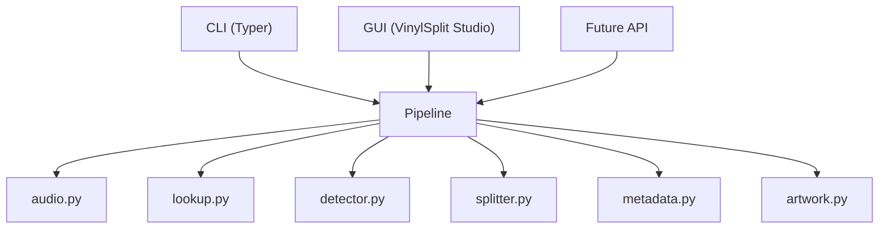

# VinylSplit Architecture

## Philosophy

VinylSplit separates user interfaces from the processing engine.

This allows multiple front ends (CLI, GUI, or future integrations) to share the same core functionality.

## System Architecture

## Design Principles

- One responsibility per module.
- Business logic never depends on the user interface.
- The original recording is never modified.
- Every feature should be testable.
- The CLI and GUI must use the same processing pipeline.